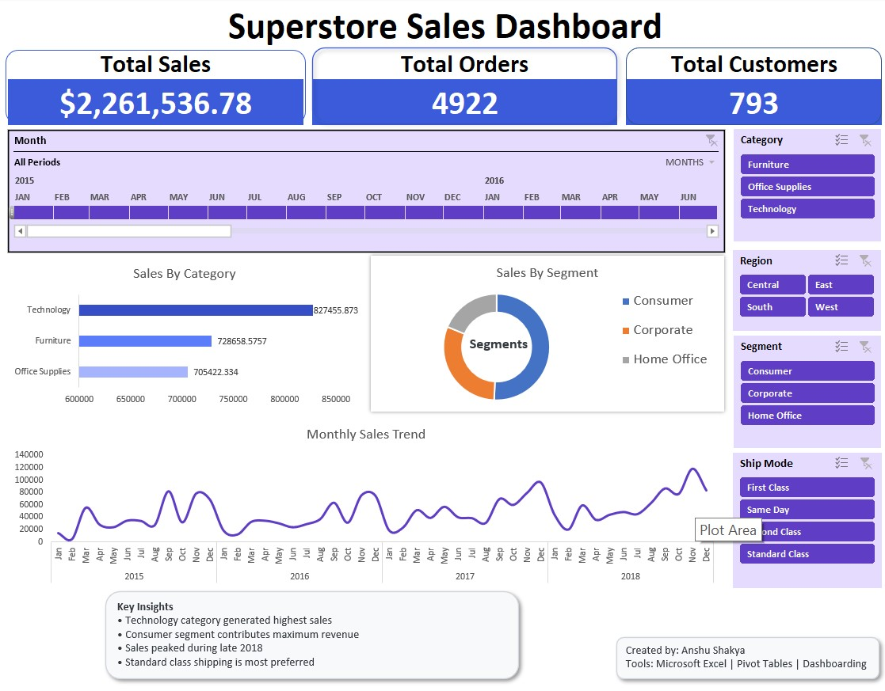

# Superstore Sales Dashboard (Excel Project)
Interactive Excel Dashboard for Retail Sales Analysis using Pivot Tables, Charts, Slicers, and Data Visualization Techniques.
## Project Overview

This project is an interactive **Sales Analysis Dashboard** created using **Microsoft Excel**.
The dashboard analyzes Superstore sales data to identify sales trends, customer segments, regional performance, and product category insights.

The project demonstrates skills in:

* Data Cleaning
* Pivot Tables
* Pivot Charts
* Dashboard Design
* Data Visualization
* Interactive Filtering
* Business Insights Generation

---

## Objective

The objective of this project is to analyze retail sales data and create a dynamic dashboard that helps understand:

* Total Sales Performance
* Customer Segments
* Regional Sales Distribution
* Monthly Sales Trends
* Category-wise Sales Performance
* Shipping Preferences

---

## Tools & Features Used

### Microsoft Excel

* Pivot Tables
* Pivot Charts
* Slicers
* Timeline Filters
* Conditional Formatting
* Data Cleaning
* Dashboard Design

---

## Dashboard KPIs

The dashboard includes the following key performance indicators:

* Total Sales
* Total Orders
* Total Customers

---

## Dashboard Features

### Interactive Filters

Users can dynamically filter the dashboard using:

* Category
* Region
* Segment
* Ship Mode
* Timeline (Order Date)

### Visualizations Included

* Sales by Category
* Sales by Segment
* Monthly Sales Trend
* Regional Analysis
* Shipping Mode Analysis

---

## Key Insights

* Technology category generated the highest sales.
* Consumer segment contributed the maximum revenue.
* Sales showed significant growth during late 2018.
* Standard Class shipping mode was the most preferred shipping method.

---

## Dataset Information

Dataset used: Superstore Sales Dataset

The dataset contains:

* Order Information
* Customer Information
* Product Categories
* Shipping Details
* Regional Data
* Sales Transactions

---

## Project Workflow

1. Data Cleaning & Preparation
2. Data Transformation
3. Pivot Table Creation
4. Data Visualization
5. Dashboard Development
6. Interactive Filtering
7. Business Insight Extraction

---

## Dashboard Preview

(Add your dashboard screenshot here)

Example:

---

## Skills Demonstrated

* Excel Dashboarding
* Business Analysis
* Data Visualization
* Analytical Thinking
* Data Cleaning
* Interactive Reporting

---

## Author

Anshu Shakya
